# Tutorial Framework Documentation

The purpose of this documentation is to provide additional details about the features of the Tutorial Framework.

## Editing narrative and instruction descriptions

You can add multiple paragraphs of text to the description fields of your tutorial page by adding line breaks between sections of text. IET parses this text and performs line wrapping per word by default, unless Chinese, Japanese or Korean characters are detected - in which case character-based wrapping is applied.

### Korean text

Due to "Han unification" - there is some overlap between Chinese, Japanese and Korean (later "CJK") characters / symbols. Korean uses spaces to distinguish between words and word wrapping is applied in a similar manner to English and most other languages.

For this purpose, we included a tag you can use to force word -based line wrapping. To force word-based wrapping, enclose the text with ```<wordwrap>```. After this, you should see wrapping occurring for each word instead of each character.

You can find more details below on how to use ```<wordwrap>```and other rich text tags.

### Using rich text in tutorial instructions and narratives

You can apply styling and add links to your tutorial content with rich text tags. Rich text tags are supported in most text fields of the Tutorial assets.

#### Supported tags

You can use the following HTML tags in the tutorial assets' text fields.

1. `<b>Text</b>`: **Text**
1. `<i>Text</i>`: *Text*
1. `<a href="https://unity.com/">Text</a>`: [Text](https://unity.com/)
1. `Text<br/>More Text`: Text<br/>More Text
1. `<wordwrap>Force word wrapping:ワードラップを強制する</wordwrap>`: Force word wrapping:ワードラップを強制する - CJK characters are considered words when wrapped, unless overridden. Use this tag to wrap Korean correctly.
1. `<style class="classname">Custom UIToolkit style class is applied to this text. Define the class in the .uss style sheet you use.</style>`
1. HTML character codes: `&amp;` `&gt;` `&lt;`: & > <

The link tag `<a href=...</a>` supports also linking to local files with relative file paths. Root directory is considered to be the project root directory. Examples:

1. `<a href="./Packages/packagename/file.txt">Link to a text file under a package</a>`
1. `<a href="./Assets/file_under_assets.pdf">File in the Assets/ -folder</a>`
1. `<a href="../ProjectName/Assets/file_under_assets.pdf">File in the Assets/ -folder</a>`

#### Leading white space indentation

Leading white space is rendered as-is - adding tabulations or spaces at the beginning of a line will render similar indentation in the content. However, additional spaces between words will be ignored.

### Possible issues

If, for example, you forget to close tags, or you have parsing issues in your text content, the tutorial will display a <style>error {color:red} </style><error>PARSE ERROR</error>. To fix this, edit the content and make sure you have no unclosed tags, wrong tags or improper tag nesting. Please refer to HTML 4.0 documentation for additional information on how to apply HTML tags.

## Tutorial media

You can choose to show image or video at the top of a tutorial page by choosing an appropriate **Header Media Type**. The specifications and recommended properties for the media are:
- tutorial page image/video: 300 x 150 (width x height)
- welcome dialog image: 700 x 200
- in your texture asset's Import Settings, make sure you have chosen **Editor GUI and Legacy GUI** as the **Texture Type**.
- for video, WebM VP8 is recommended ([read more](https://docs.unity3d.com/Manual/VideoSources-FileCompatibility.html))

## Masking 

We can mask and unmask any part of the Editor to prevent unwanted interactions. It's also a good way to teach users where certain actions take place.

For each tutorial page, there's an **Enable Masking** checkbox.

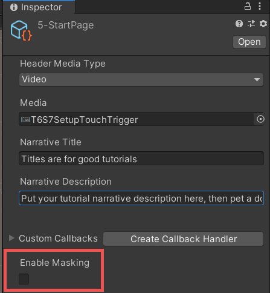

Tick the checkbox to enable the masking settings. This will immediately mask out the entire Editor except for the Tutorials window. You can't click or interact with anything that's masked. Fortunately, the authoring tools provide a masking preview toggle: click the **Preview Masking** button in the tutorial authoring toolbar to either disable or preview the masking: 

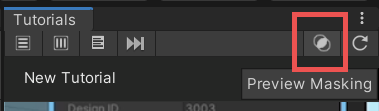

Now that you can interact with the rest of the Editor again, return to the newly enabled masking settings in the Inspector:

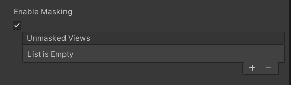

Use the **Add** (**+**) button to specify windows and areas you'd like to unmask. You can unmask multiple windows and areas simply by adding more unmasked views.

### Example: unmasking an editor window
- Click the **Add** (**+**) button to add an unmasked view.
- Change the **Selector Type** to **Editor Window**. This will let you select a window type from a list of options. All windows within Unity Editor can be found and accessed through this list.
- For the now available **Editor Window Type** setting, select **ProjectBrowser** as the value.
- Enable **Preview Masking** to confirm that the Editor is masked except for the Project window.

Note: the names of the **Editor Window Type** options displayed are simplified by default. You can change a setting from **Edit** > **Preferences** > **In-Editor Tutorials** to show fully qualified names instead.

### Example: unmasking elements in the toolbar
- Click the **Add** (**+**) button to add an unmasked view.
- Make sure the **Selector Type** is set to **GUI View**. Set the **View Type** to **Toolbar**.
- Next, add a new **Unmasked Controls** entry. This setting allows us to refine what to mask out within a specific window/Editor area.
- We want to unmask the Play button which needs to be configured differently depending on the used Unity version:
  - Unity 2020.3 and older:
    - Change the **Selector Mode** to **Named Control**
    - Input "ToolbarPlayModePlayButton" as the **Control Name**.
  - Unity 2021.1 and newer:
    - Change the **Selector Mode** to **Visual Element**.
    - Input "Play" as the **Visual Element Name**.
  - If you want to support both Unity version ranges, simply implement two unmasked views with the appropriate settings.
- Enable **Preview Masking** again to check that only the Play button is unmasked.

Read more about the different configuration needs for the toolbar buttons [here](#configuring-masking-of-scene-view-tools-and-play-mode-buttons).

### Example: unmasking a property in the Inspector
Another common unmasking you might want to do is to unmask a property in the Inspector. Let's say you want to unmask the x, y and z positions of a Transform component. These are all properties of a Transform component, so we set up our masking settings as follows: 

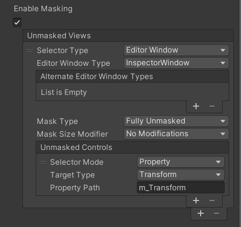

Note: this will work on whichever GameObject is currently active within the Inspector! It's best practice to make sure that a user has selected whichever GameObject's properties you want the user to modify within the same tutorial page, and to use masking accordingly to ensure no other object will be selected. 

See [Masking settings](#masking-settings) for a full breakdown of the various settings.


### Configuring masking of Scene view tools and Play mode buttons

#### UI implementation differences between Unity versions

In 2021.1, the implementation of Scene view tools and Play mode buttons changed from [IMGUI] to [UI Toolkit], meaning, for Unity versions 2020.3 and older,
the **Named Control** selector mode needs to be used to configure the masking of common toolbar controls, and for Unity 2021.1 and newer, the **Visual Element Name**
selector mode must be used instead. For reference, the Scene view controls have the following names:
|Control|Named Control|Visual Element Name|
|---|---|---|
|Hand/View|ToolbarPersistentToolsPan|ViewTool|
|Move|ToolbarPersistentToolsTranslate|MoveTool|
|Rotate|ToolbarPersistentToolsRotate|RotateTool|
|Scale|ToolbarPersistentToolsScale|ScaleTool|
|Rect|ToolbarPersistentToolsRect|RectTool|
|Transform|ToolbarPersistentToolsTransform|TransformTool|
|Tool Handle Position|ToolbarToolPivotPositionButton|Pivot Mode|
|Tool Handle Rotation|ToolbarToolPivotOrientationButton|Pivot Rotation|
|Custom Tools|ToolbarPersistentToolsCustom|toolbar-contents*|

<sub>*__Visual Element Name__ not applicable, use __Visual Element Class Name__ instead.</sub>

The names of the Play mode controls are:
|Control|Named Control|Visual Element Name|
|---|---|---|
|Play|ToolbarPlayModePlayButton|Play|
|Pause|ToolbarPlayModePauseButton|Pause|
|Step|ToolbarPlayModeStepButton|Step|

Additionally, the Editor's Scene view tools UI changed significantly between 2020.3 and 2021.1, moving the tools from the top toolbar into the Scene view.
This requires you to adjust any existing Scene view tools masking settings as follows:
|Property|Unity 2020.3 and older |Unity 2021.1 and newer|
|---|---|---|
|Selector Type|GUI View|Editor Window
|View Type|UnityEditor.Toolbar|UnityEditor.SceneView
|Selector Mode|Named Control|Visual Element Name

For the Play mode controls, simply switch to use the appropriate visual element names seen in the above table. Note that, for now, it's not easy to support both Unity version ranges in your project,
so it's recommended to implement different versions of the tutorial for different Unity versions.

#### Assembly differences between Unity versions

Certain editor windows, for example, `SceneView`, were moved from `UnityEngine` assembly to `UnityEngine.CoreModule` in Unity 2020, which can cause problems with masking settings
if upgrading a tutorial project from Unity 2019 to Unity 2020 and newer. In your masking settings, look for **Editor Window Type** fields with yellow background to spot these misconfigurations.
Note that in most cases the masking settings should still work; a tooltip will reveal more information about the type in question.

As a workaround, if wanting to support both Unity version ranges using the same asset, it's possible to use the older Unity version to author the value of **Editor Window Type** and the newer Editor version to author the
value of **Alternate Editor Window Types**. As a result, the masking settings of a serialized `TutorialPage` asset should look like this:
```
m_MaskingSettings:
  m_MaskingEnabled: 1
  m_UnmaskedViews:
  - m_SelectorType: 1
    m_ViewType:
      m_TypeName: 
    m_EditorWindowType:
      m_TypeName: UnityEditor.SceneView, UnityEditor, Version=0.0.0.0, Culture=neutral, PublicKeyToken=null
    m_AlternateEditorWindowTypes:
      m_Items:
      - Type:
          m_TypeName: UnityEditor.SceneView, UnityEditor.CoreModule, Version=0.0.0.0, Culture=neutral, PublicKeyToken=null
```

When editing the tutorial pages, pay attention that you don't accidentally clear these values when committing changes to the version control.

Note that the same issue applies also for certain GUI views, for example, `UnityEditor.Toolbar`, but there's no currently similar fallback mechanism available to work around these issues.
In your masking settings, look for **View Type** fields with yellow background to spot these misconfigurations. In problematic GUI view's case, you need to upgrade the tutorial to support 
only newer Unity version, or alternatively implement different versions of the tutorial for different Unity versions.

## Future Prefabs and Criteria 

A good way to review many of the concepts within this guide is to create a "Future Prefab Instance". This is useful for tutorials that ask the user to spawn a prefab in the scene, and then modify values of said prefab within the scene. However, since the prefab doesn't exist in the scene until it's initialized, it requires some work, as follows.

First, let's create a new scene and a new Tutorial with at least two **Narrative with Instructions** tutorial pages, and the scene, attached to it: 

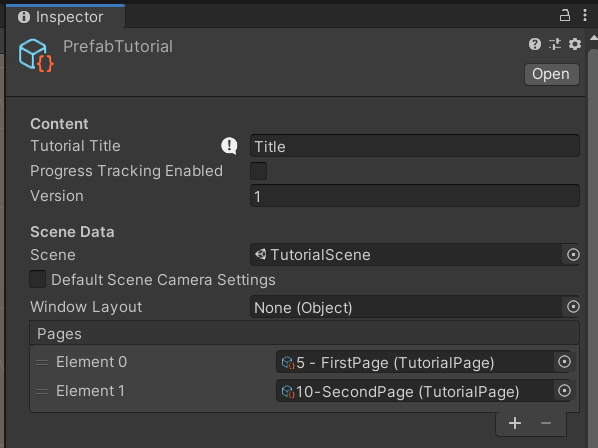

And assign it to the list of tutorials in the Tutorials file. For this tutorial, you can use any script with any property. This example features a simple Cube Prefab with a Prefab script attached. The script only contains a public int called magicNumber.

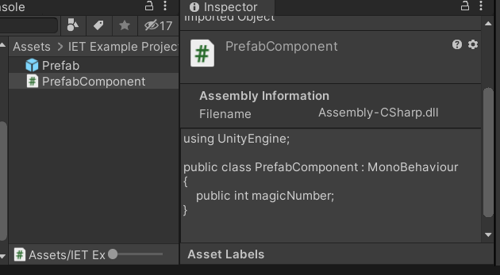

Make sure the prefab isn't currently spawned in the scene (you can have multiples of the same prefab, but this example is easier to explain using only one). Then, go to your first tutorial page and set it up similarly to this: 

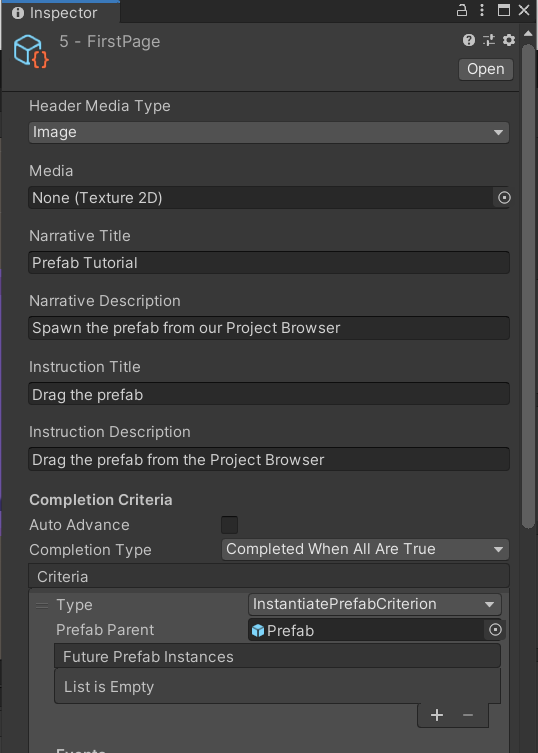

With the following masking settings:

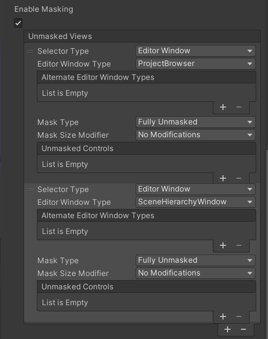

The criterion used is Unity.InteractiveTutorials.InstantiatePrefabCriterion. For the Prefab Parent, drag in the Prefab from the Project window. Click the **Add** (**+**) button next to "Future Prefab Instances: List is Empty" twice. This will create two new slots: None (Object) 

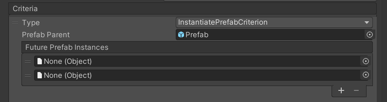

Now select the prefab from the Project window.
With the Prefab instance open in the Inspector, click on the lock in the upper right to lock the Inspector and make sure it won't change focus when you select another Asset or GameObject.

Open another Inspector window, and select the asset representing the first Tutorial Page.
From the Project window, drag the instantiated prefab into this first empty Future Prefab Instance slot.
Then drag the **PrefabComponent** script from the Inspector to the second one and save the scene.

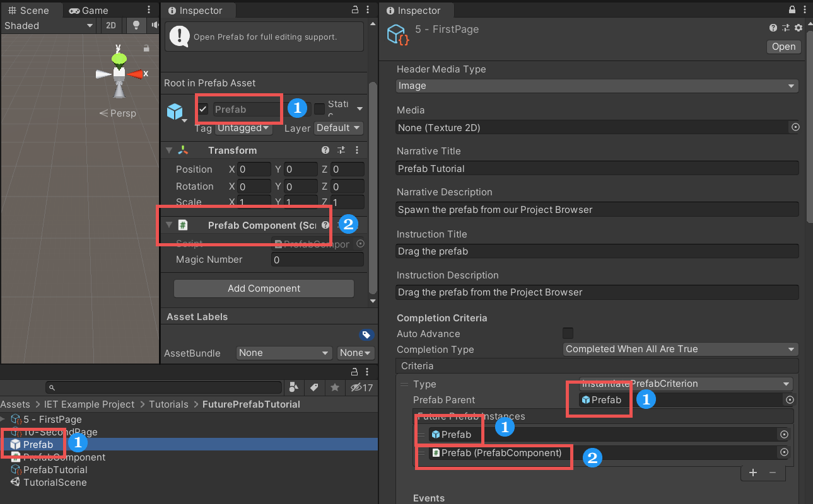

You should now see two new children object appear in the tutorial page in the Project window, the first one being the reference to the GameObject, the second being a reference to the Prefab script. 

The newly created children of the tutorial page are the Future Prefab Instance's references. The names depends on where they were created (Paragraph 1, Criterion 1, 1: Prefab (GameObject). Depending on which paragraph, how many criteria, or what the object is, these might change. Avoid changing the names, to ensure that they work correctly. You will need to use these object in the next tutorial page.  

In the second tutorial page, let's add another instruction paragraph. We want the user to modify the magicNumber property on our prefab, so we'll add a PropertyModificationCriterion as criteria. Within this criteria are a couple of options we need to modify.  

Firstly, the **Property Path** is the name of the property. In the current prefab, it's named "magicNumber". If the property is derived from a different script, you can still access it, "Otherscript.magicNumber", for instance (Tip: If you're ever unsure what the property path is - for internal properties for instance - you can set your Inspector to Debug mode and alt-left click on the name of the property).

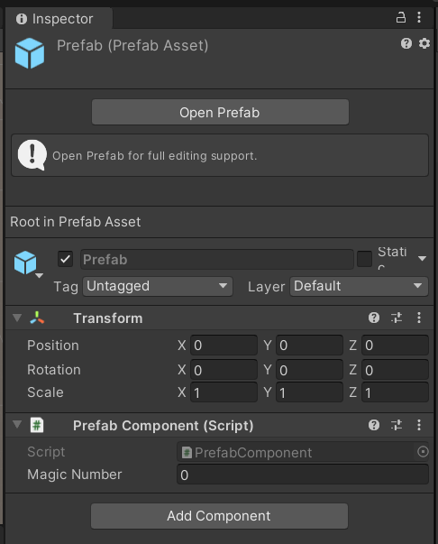

Next, the **Target Value Mode** can either be set to **Target Value** or to **Different Than Initial**. This setting is fairly self-explanatory - if you want a user to set a property to a specific value, enter the desired value in the **Target Value** property. If you just want the user to change a property without anything specific in mind, set it to **Different Than Initial** and you can ignore the Target Value property below. Remember to set a Target Value if you're using Target Value in Target Value Mode. 

In combination with that, you must set the **Target Value Type**. This denotes what type of property the user is changing. This has to be set correctly so make sure the type matches the property. In case of our magicNumber this would be an int, so set Target Value Type to integer.  

Lastly and most importantly is the **Target**, where a reference needs to be set. Try to drag the component reference created earlier to the Target: 

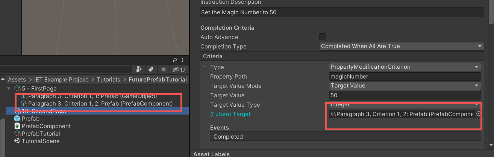

It is worth noting that for this type of Criteria, the IET Framework relies on assigning the component as target rather than the GameObject. If you simply assigned the GameObject, the system would not be able to detect changes on the **PrefabComponent** component.

You can now close the second Inspector window we opened and unlock the original Inspector on the right.  

Make sure your scene is saved. If you're running the tutorial, you can click the **Run Startup Code** in the tutorial authoring toolbar to restart the tutorial. This resets the tutorial progress, displays the first page, and reloads the scene.  

If you go through the tutorial now, you'll be able to set the magicNumber to 50 and see that this results in successful completion of the task.  

To finish, let's set up masking for this second page so that it only lets the user edit the property. 

Enable Masking on the second Tutorial page. Set **Selector Type** to Editor Window, **Editor Window Type** to InspectorWindow, **Mask Type** to Fully Unmasked and **Mask Size Modifier** to No Modifications. We also need to add an "Unmasked Controls", so click the **Add** (**+**) button. 

Within the Unmasked Controls, set **Selector Mode** to Property. The next step is to correctly set up the **Target Type**.  

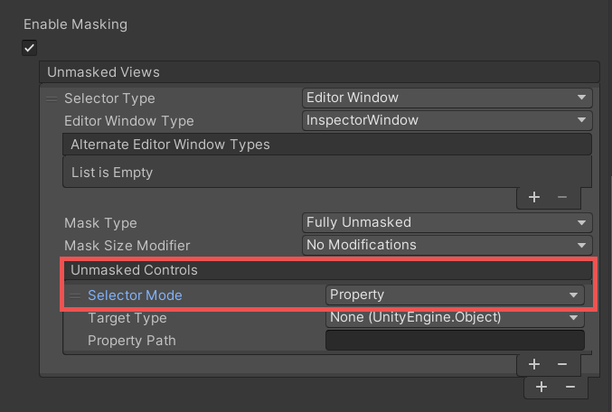

The Target Type within this Unmasked Controls lists every single script that exists within Unity and any packages in your project. Your custom-created scripts should be towards the top of this list, unless you have Cinemachine installed, in which case they'll be below those. Note that your scripts don't include any inheritance - so your PrefabScript will be listed as just that, as opposed to other scripts which are listed as UnityEngine.Something.  Select the PrefabScript from this list of Target Types. Lastly, set the **Property Path** to magicNumber.  

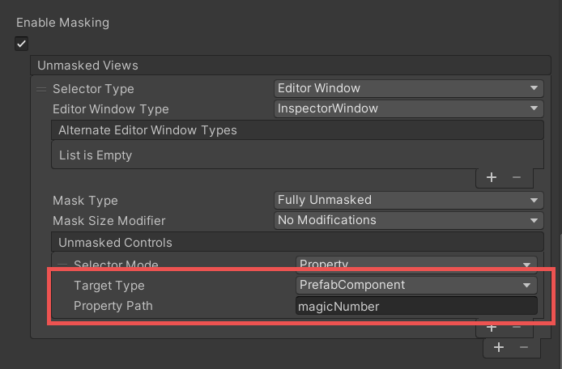

Restart the Tutorial - but make sure you don't save! Saving the scene would mean that the tutorial would start with a Prefab already existing in the Hierarchy and therefore in the scene.

You should be able to go through the tutorial now with everything masked correctly.  

Remember that it's a best practice to have these two instructions on the same page. Though we have masked everything out, there's always a chance something will go awry when instructions for selecting an object and modifying it are on two separate pages.   

## Criteria Descriptions 

Here's a list of all other criteria with brief descriptions of what they do.  

Remember to save the scene any time that you assign an object reference from the scene. This adds a hidden component ([SceneObjectGuid](xref:Unity.Tutorials.Core.SceneObjectGuid)) to the scene that holds the reference required for this framework to work correctly.

**ActiveToolCriterion** 

This criterion checks which tool the user currently has active - View, Move, Rotate, Scale, Rect, or Transform. You can use it to ensure that a user currently has the appropriate tool selected.

**ArbitraryCriterion** 

This is a special criterion which allows the tutorial author to specify any kind of logic by writing code in ScriptableObject or MonoBehaviour and assigning an instance of an object and a function that returns a boolean as a callback. It was added in 0.5.1.

**BuildStartedCriterion** 

This checks if the user has initiated a build.

**ComponentAddedCriterion** 

This criterion requires a user to add a specific component to a specific game object. You can assign a target game object normally, and pick a required component from a list of all available components (pre-existing in the engine, packages and custom ones) 

**EditorWindowCriterion** 

This criterion is useful for asking a user to open a specific window within the editor. You can select the window from the **Editor Window Type** list, and have the option to close the window if it's currently open thus forcing the user to open it themselves. 

**FrameSelectedCriterion** 

This ensures that the user Frame Selects a particular Game Object. This only requires an Object Reference.  

**InstantiatePrefabCriterion** 

As described above, you can check if a user has instantiated an object, and also create a Future Prefab Instance to use in other Tutorial Criteria. Future Prefab Instances can be created for components as well, so make sure you're creating the appropriate reference!

**MaterialPropertyModifiedCriterion** 

Assigns a Material in the Target Slot and sets Material Property Path to "_Color" to check whether a user has changed the color of a material.

**PackageInstalledCriterion** 

Checks whether a Unity Package Manager (UPM) package is installed in the project.

**PlayModeStateCriterion** 

Checks which Play mode the Editor is in. It can be toggled between Playing or Not Playing.

**PrefabInstanceCountCriterion** 

Checks how many prefabs exist within a scene. Can change **Comparison Mode** to decide how **Instance Count** works. You can set it to check if the amount of a certain prefab within a scene is at least "x" amount, exactly "x" amount or no more than "x" amount. The "x" amount is set in Instance Count and ranges between 0 and 100. 

<!-- Dev note: PreprocessBuildCriterion exists as a side effect of BuildStartedCriterion implementation but it's not meant to be used by the end user. -->

**PropertyModificationCriterion** 

Checks whether a Property within a GameObject has been modified. You need the exact property path (tip: putting the editor into Debug mode and alt-left clicking on a property name will give you the correct name).

Set the Target Value Mode to be either a Target Value or to be Different Than Initial. This lets you decide if you want the user to set the property to be a specific value or just something different than it was at the beginning.  

The Target Value field is where you enter the required target value, if necessary.  

Target Value Type has to be set appropriately (Integer, Decimal, Text, Boolean or Color) for this to work.

**RequiredSelectionCriterion** 

Checks to ensure the user has selected the correct GameObject/asset. This can be an object in the Hierarchy or an asset from the Project window. Especially helpful to appear ahead of ModifyProperty criteria, etc. 

**SceneAddedToBuildCriterion** 

This allows you to check whether a specific scene exists in the Project Build Settings. If the scene already exists in the Build Settings, the criteria will automatically be completed upon reaching it. Otherwise, the user has to drag the scene in as expected.

**SceneViewCameraMovedCriterion** 

Checks if the user has moved, zoomed or orbited around within the current scene view. 

<!-- Dev note: MockCriterion exists for the devs but it's not visible for the end user. -->

## Masking settings

The masking is configured by using _selectors_ that specify the UI elements that should be unmasked when masking is applied to the Editor. A selector can specify a window/view or controls in a window/view.

### Selector types

The **Selector Type** is needed to specify the underlying type of the window/view you wish to unmask. There exists two distinct types in the Editor, _editor windows_ and _GUI views_.

**Editor Window** 

This type is used in most cases to specify which editor window you'd like to reveal to the user. Select **Editor Window** as the **Selector Type** and pick the window you want to unmask 
from the options available in the **Editor Window Type** menu. For instance, the type of the Hierarchy window is `UnityEditor.SceneHierarchyWindow`.
**Alternate Editor Window Types** can be used as a fallback mechanism in some cases; see [Assembly differences between Unity versions](#assembly-differences-between-unity-versions)

**GUI View** 

For a handful of cases, the **GUI View** type needs to be used instead. You'll mostly want to use this type when configuring the tutorial user's access to the controls in the [toolbar](https://docs.unity3d.com/Manual/Toolbar.html) 
of the Editor, for example, the Play button. Selecting **GUI View** as the **Selector Type** allows you to specify **View Type** instead of **Editor Window Type**.
The type of the toolbar is `UnityEditor.Toolbar`.

### Other settings

**Mask Type** controls whether or not the window is fully unmasked and can be interacted with, or if it's revealed and highlighted for the user but not actually interactive. 
By default, **Fully Unmasked** means the user can interact freely within this window. Any functionality within a fully unmasked window will be accessible to the user. The **Block Interactions** option will make the window easier to look at, but prevent a user from interacting with it. 

**Mask Size Modifier** can be used to expand the width of the mask to the whole window if wanted.

**Selector Match Type** lets you control which element(s) (the last, the first, all of them) is/are chosen if multiple elements match the chosen selector.

### Selector modes

**GUI Content**

GUI Content allows you to enter a text, tooltip text, or image via reference. [IMGUI] content with matching properties will not be masked in the Editor.

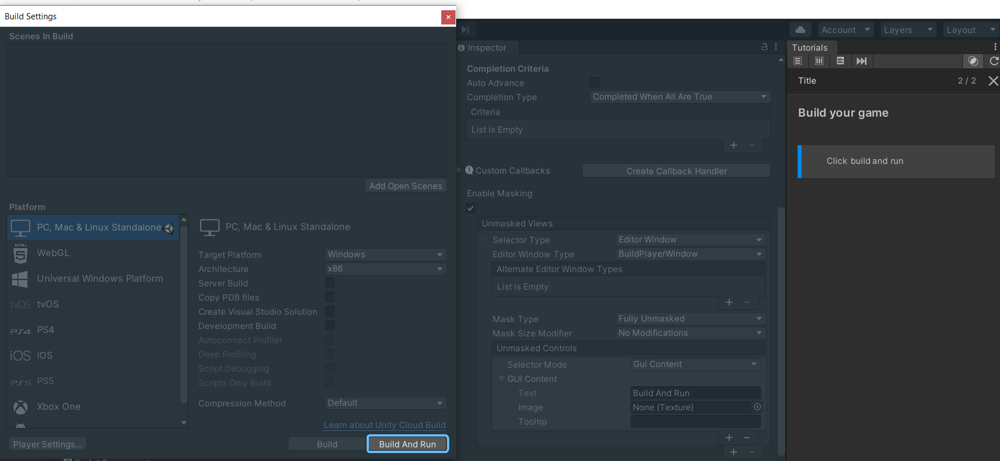

For example, in the above screenshot, "Build And Run" is entered in the **Text** property of the **Unmasked Controls**, and everything aside from that button is masked out. This is contextual depending on which Editor window you have selected. You could use this to unmask specific Assets within the Project window or GameObjects within the Hierarchy.

**Named Control** 

Named Control is used for [specifically named IMGUI controls](https://docs.unity3d.com/ScriptReference/GUI.SetNextControlName.html) within the Unity Editor.
Typically this option is used to [select Scene view tools and Play mode buttons](#configuring-masking-of-scene-view-tools-and-play-mode-buttons).

**GUI Style Name** 

GUI Style Name allows you to enter a [name of a GUIStyle](https://docs.unity3d.com/ScriptReference/GUIStyle-name.html).
IMGUI elements drawn with the specified style will be unmasked.

**Object Reference** 

Allows you to specify an IMGUI element for a specific Unity object, a scene object or an asset, which will be unmasked.
Note that for assets, currently the asset's name must be very short in order for the unmasking to work; if the name is not short
and appears in a shortened form (ends with ellipsis), the unmasking doesn't work.

**Property** 

This option allows you to specify any serialized object property shown in the Inspector. You can view property names by changing the Inspector into debug mode via 
the "..." button at the top-right corner of the Inspector window, then holding Alt/Option and clicking on a property name.

**Visual Element**

The **Visual Element** selector mode is used to select desired [UI Toolkit] (formerly known as UIElements) elements, also known as visual elements.
The wanted element can be specified using the following properties:
- **Visual Element Type Name**, the fully qualified C# class/type name of the element, for example, "UnityEngine.UIElements.Button"
- **Visual Element Class Name**, the Unity style sheet class name, for example, "unity-button"
- **Visual Element Name**, the name of the element, for example, "updateButton"

In many cases, specifying only one of these properties should suffice, but in some cases you will need to specify all three of them.

The easiest way to select the desired visual element is to use the visual element picker functionality by clicking the **Pick Visual Element** button. 
After clicking this button, you can select an Editor UI element, and if the selected element was a visual element, its values are set to the appropriate fields.

## UI debuggers
### UI Toolkit debugger
It's not always possible to select the desired visual element using the visual element picker. In these cases you should be able to figure out the names and classes of various visual elements in the Editor by using the UI Toolkit Debugger. The debugger can be accessed using the following methods:
- Unity 2020 and newer: navigate to **Window** > **UI Toolkit** > **Debugger**.
- Unity 2019: navigate to **Window** > **Analysis** > **UIElements Debugger**.
- Each editor window's context menu ("..." button at the top-right corner) should also contain an item to access the debugger.
- The keyboard shortcut Ctrl + F5 can also be used.

It's recommended to use the **Pick Element** functionality to reveal visual elements and their properties while hovering the mouse cursor on top the UI.
In the debugger's left-side tree view, you can see the needed properties for each visual element in the following order, from left to right:
1. The C# class/type name of the element—note that this is not the fully qualified name.
    - For example, for the name "Button", the fully qualified name would be "UnityEngine.UIElements.Button"
    - The fully qualified names can be deduced, for example, from the Unity's [Scripting API documentation](https://docs.unity3d.com/ScriptReference/UIElements.Button.html)
2. The name of the element, if any.
    - Visual element names begin with a pound sign (#), for example "#viewdiff".
    - Omit the pound sign when inputting the name as the **Visual Element Name** value, that is, input "viewdiff".
3. The Unity style sheet class name—usually present but might be missing for some container elements.
    - Visual element class names begin with a period (.), for example ".unity-button".
    - Omit the period when inputting the class name as the **Visual Element Class Name** value, that is, use "unity-button".

### IMGUI debugger
For older Unity versions and older parts of the Editor UI in general, the IMGUI Debugger might be useful. Go to **Window** > **Analysis** > **IMGUI Debugger** 
or alternatively the keyboard shortcut Alt/Option + 5.

## Tutorial Styles

The Tutorial Styles asset can be created within the Project window by right-clicking and going to **Create** > **Tutorials** > **Tutorial Styles**. This asset allows you to modify everything visual about the walkthrough:

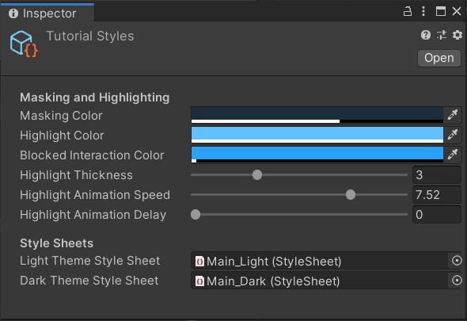

In order for any of these changes to take effect, this asset must be assigned within the Tutorial Project Settings asset. 

### Tutorial Style Sheets

Tutorial Style Sheets can be used to fully customize the style of the Tutorials window. Use **Create** > **Tutorials** > **Light Tutorial Style Sheet** and **Dark Tutorial Style Sheet** to create style sheets for customization and assign the style sheets as Light/Dark Theme Style Sheet of your Tutorial Styles. The dark/light theme is applied according to the user's Editor Theme preference.

## Tutorial Project Settings

Tutorial Project Settings is another asset that you can create within the Project window, by right-clicking and going to **Create** > **Tutorials** > **Tutorial Project Settings**. The settings in this asset are automatically applied to the entire project as soon as this asset is created.

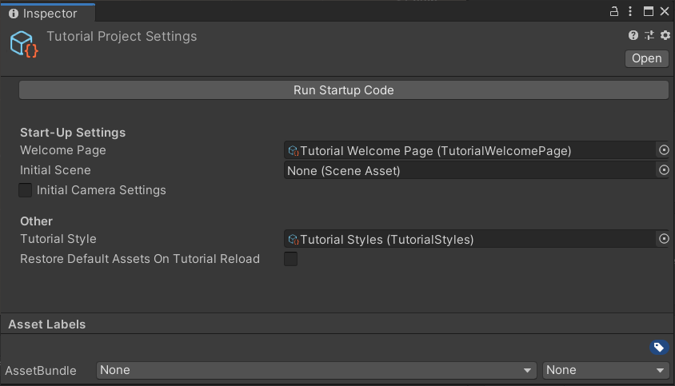

The settings allow you to modify the following:

**Welcome Page**

If set, this page is shown in the welcome dialog when the project is started for the first time.

**Initial Scene**

If set, this scene will be loaded when the project is started for the first time.

**Initial Camera Settings**

If enabled, allows for tweaking of the position/rotation of the camera of the Initial Scene

**Restore Default Assets On Tutorial Reload** 

When enabled, a backup of your project's `Assets` folder is made into `Tutorial Defaults` folder when the tutorial project is started for the first time in non-authoring mode, 
meaning, the Tutorial Authoring Tools package is not present. Every time a tutorial is started, the backup is restored, meaning that any modifications to the original tutorial project assets will be lost.
With this option disabled (the default), changes made to assets will remain as usual.

Enabling this feature means that the size of your project will double and you should configure your version control software to ignore the `Tutorial Defaults` folder.
 If your project has lot of large assets or includes several tutorials that build upon each other, you should have this option disabled to prevent errors!


**Tutorial Style**

This is where you assign your Tutorial Styles asset. This changes the visuals of your tutorials (see section above).

[IMGUI]: https://docs.unity3d.com/Manual/GUIScriptingGuide.html
[UI Toolkit]: https://docs.unity3d.com/Manual/UIElements.html